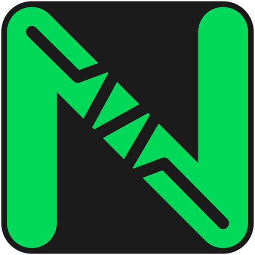

# Nova Audio Converter

  
  
  
A sleek, lightweight, and modern audio optimization tool for your video files.

  
  

    
    
    
  

---

## About Nova Audio Converter
Nova Audio Converter is designed to make optimizing audio in video files simple, fast, and visually appealing. Built with C# and WPF, it provides a seamless experience for users who want to streamline their media library without compromising quality.

I created this tool to make it easier to convert audio tracks through FFmpeg. Since my audio goes through toslink I don't have the benefits of uncompressed digital formats like DTS HD, Dolby Digital Plus or Dolby Atmos for example. Instead of going through the command prompt for every single video I created this to make it a bit easier and faster to manage. 

## Key Features

* **Optimized Conversion:** Leverages the power of `FFmpeg` for fast and efficient audio re-encoding.
* **Modern UI:** Clean design with smooth, native support for **Dark Mode** and **Light Mode**.
* **Multilingual:** Fully translatable interface via external XML files (currently supports NL and EN).
* **Smart Checks:** The application automatically checks for `FFmpeg` at startup and assists with installation if missing.
* **Portable & Clean:** No messy registry entries; everything required for the application is contained within a clean, professional installer.

## Requirements

* **OS:** Windows 10 or later.
* **Runtime:** .NET 10.0 (or later).
* **Dependencies:** [FFmpeg](https://ffmpeg.org/) (the application will guide you through the installation if it is not found).

## Installation

### Via the Installer (Recommended)
1. Go to the [Releases page](https://github.com/solivagantstudios/Nova-Audio-Converter/releases).
2. Download the latest `NAC-setup.exe`.
3. Run the installer and follow the on-screen instructions.

### Manual Installation
1. Download the latest release zip.
2. Extract the contents to a folder of your choice.
3. Ensure the `Locales` folder remains in the same directory as `NovaAudioConverter.exe`.

## Usage
1. Launch **Nova Audio Converter**.
2. Click **Browse** to select your video file.
3. Configure your desired **Audio Codec**, **Bitrate**, and **Sample Rate**.
4. Click **Start Optimisation** and monitor the progress in the console.

## Contributing
Contributions are highly welcome! Whether you want to add a new language, fix a bug, or improve the UI, feel free to contribute:
1. Fork the repository.
2. Create your feature branch (`git checkout -b feature/your-feature`).
3. Commit your changes.
4. Push to the branch.
5. Open a Pull Request.

## License
This project is licensed under the **GNU General Public License v3.0 (GPLv3)**. See the `LICENSE` file for more details.
